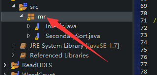
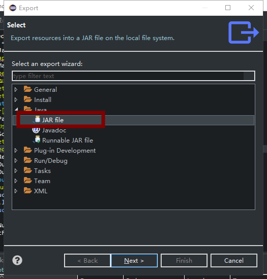
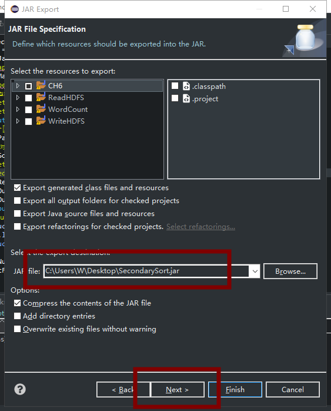
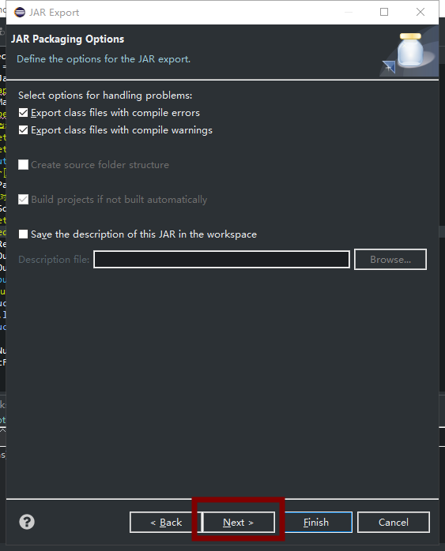
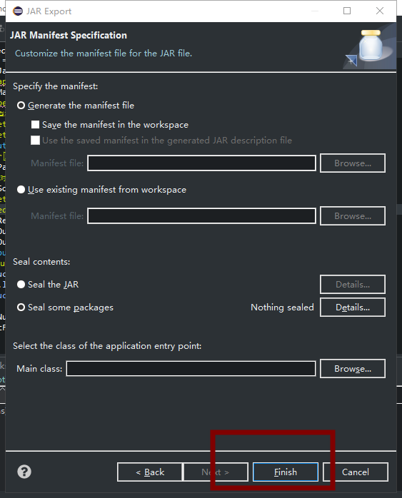
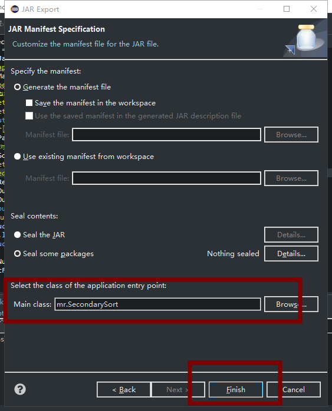

# MapReduce实验：二次排序

## 6.1 实验目的
基于MapReduce思想，编写SecondarySort程序。  


## 6.2 实验要求
要能理解MapReduce编程思想，会编写MapReduce版本二次排序程序，然后将其执行并分析执行过程。  


## 6.3 实验原理  
MR默认会对键进行排序，然而有的时候我们也有对值进行排序的需求。满足这种需求一是可以在reduce阶段排序收集过来的values，但是，如果有数量巨大的values可能就会导致内存溢出等问题，这就是二次排序应用的场景——将对值的排序也安排到MR计算过程之中，而不是单独来做。
二次排序就是首先按照第一字段排序，然后再对第一字段相同的行按照第二字段排序，注意不能破坏第一次排序的结果。  

## 6.4 实验步骤
### 6.4.1 编写程序
程序主要难点在于排序和聚合。  
对于排序我们需要定义一个IntPair类用于数据的存储，并在IntPair类内部自定义Comparator类以实现第一字段和第二字段的比较。  
对于聚合我们需要定义一个FirstPartitioner类，在FirstPartitioner类内部指定聚合规则为第一字段。  
此外，我们还需要开启MapReduce框架自定义Partitioner 功能和GroupingComparator功能。  
#### IntPair 类：  
```java
package mr;

import java.io.DataInput;
import java.io.DataOutput;
import java.io.IOException;

import org.apache.hadoop.io.IntWritable;
import org.apache.hadoop.io.WritableComparable;

public class IntPair implements WritableComparable {
    private IntWritable first;
    private IntWritable second;
    public void set(IntWritable first, IntWritable second) {
        this.first = first;
        this.second = second;
    }
    //注意：需要添加无参的构造方法，否则反射时会报错。
    public IntPair() {
        set(new IntWritable(), new IntWritable());
    }
    public IntPair(int first, int second) {
        set(new IntWritable(first), new IntWritable(second));
    }
    public IntPair(IntWritable first, IntWritable second) {
        set(first, second);
    }
    public IntWritable getFirst() {
        return first;
    }
    public void setFirst(IntWritable first) {
        this.first = first;
    }
    public IntWritable getSecond() {
        return second;
    }
    public void setSecond(IntWritable second) {
        this.second = second;
    }
    public void write(DataOutput out) throws IOException {
        first.write(out);
        second.write(out);
    }
    public void readFields(DataInput in) throws IOException {
        first.readFields(in);
        second.readFields(in);
    }
    public int hashCode() {
        return first.hashCode() * 163 + second.hashCode();
    }
    public boolean equals(Object o) {
        if (o instanceof IntPair) {
            IntPair tp = (IntPair) o;
            return first.equals(tp.first) && second.equals(tp.second);
        }
        return false;
    }
    public String toString() {
        return first + "\t" + second;
    }
    public int compareTo(Object o) {
        IntPair tp=(IntPair) o;
        int cmp = first.compareTo(tp.first);
        if (cmp != 0) {
            return cmp;
        }
        return second.compareTo(tp.second);
    }
}
```

#### 完整代码：
```java
package mr;

import java.io.IOException;

import org.apache.hadoop.conf.Configuration;
import org.apache.hadoop.fs.Path;
import org.apache.hadoop.io.LongWritable;
import org.apache.hadoop.io.NullWritable;
import org.apache.hadoop.io.Text;
import org.apache.hadoop.io.WritableComparable;
import org.apache.hadoop.io.WritableComparator;
import org.apache.hadoop.mapreduce.Job;
import org.apache.hadoop.mapreduce.Mapper;
import org.apache.hadoop.mapreduce.Partitioner;
import org.apache.hadoop.mapreduce.Reducer;
import org.apache.hadoop.mapreduce.lib.input.FileInputFormat;
import org.apache.hadoop.mapreduce.lib.output.FileOutputFormat;

public class SecondarySort {
    static class TheMapper extends Mapper<LongWritable, Text, IntPair, NullWritable> {
        @Override
        protected void map(LongWritable key, Text value, Context context)
                throws IOException, InterruptedException {
            String[] fields = value.toString().split("\t");
            int field1 = Integer.parseInt(fields[0]);
            int field2 = Integer.parseInt(fields[1]);
            context.write(new IntPair(field1,field2), NullWritable.get());
        }
    }
    static class TheReducer extends Reducer<IntPair, NullWritable,IntPair, NullWritable> {
        //private static final Text SEPARATOR = new Text("------------------------------------------------");
        @Override
        protected void reduce(IntPair key, Iterable<NullWritable> values, Context context)
                throws IOException, InterruptedException {
            context.write(key, NullWritable.get());
        }
    }
    public static class FirstPartitioner extends Partitioner<IntPair, NullWritable> {
        public int getPartition(IntPair key, NullWritable value,
                int numPartitions) {
            return Math.abs(key.getFirst().get()) % numPartitions;
        }
    }
    //如果不添加这个类，默认第一列和第二列都是升序排序的。
//这个类的作用是使第一列升序排序，第二列降序排序
    public static class KeyComparator extends WritableComparator {
        //无参构造器必须加上，否则报错。
        protected KeyComparator() {
            super(IntPair.class, true);
        }
        public int compare(WritableComparable a, WritableComparable b) {
            IntPair ip1 = (IntPair) a;
            IntPair ip2 = (IntPair) b;
            //第一列按升序排序
            int cmp = ip1.getFirst().compareTo(ip2.getFirst());
            if (cmp != 0) {
                return cmp;
            }
            //在第一列相等的情况下，第二列按倒序排序
            return -ip1.getSecond().compareTo(ip2.getSecond());
        }
    }
    //入口程序
    public static void main(String[] args) throws Exception {
        Configuration conf = new Configuration();
        Job job = Job.getInstance(conf);
        job.setJarByClass(SecondarySort.class);
        //设置Mapper的相关属性
        job.setMapperClass(TheMapper.class);
        //当Mapper中的输出的key和value的类型和Reduce输出
//的key和value的类型相同时，以下两句可以省略。
        //job.setMapOutputKeyClass(IntPair.class);
        //job.setMapOutputValueClass(NullWritable.class);
        FileInputFormat.setInputPaths(job, new Path(args[0]));
        //设置分区的相关属性
        job.setPartitionerClass(FirstPartitioner.class);
        //在map中对key进行排序
        job.setSortComparatorClass(KeyComparator.class);
        //job.setGroupingComparatorClass(GroupComparator.class);
        //设置Reducer的相关属性
        job.setReducerClass(TheReducer.class);
        job.setOutputKeyClass(IntPair.class);
        job.setOutputValueClass(NullWritable.class);
        FileOutputFormat.setOutputPath(job, new Path(args[1]));
        //设置Reducer数量
        int reduceNum = 1;
        if(args.length >= 3 && args[2] != null){
            reduceNum = Integer.parseInt(args[2]);
        }
        job.setNumReduceTasks(reduceNum);
        job.waitForCompletion(true);
    }
}
```

### 详细步骤 
```
[stu050 root@master ~]# jps
652 NameNode
1460 Jps
1143 ResourceManager
899 SecondaryNameNode


[stu050 root@master ~]# hadoop fs -put /root/data/6/secsortdata.txt  /


[stu050 root@master ~]# hadoop fs -ls /
Found 1 items
-rw-r--r--   3 root supergroup         60 2019-11-24 20:20 /secsortdata.txt


[stu050 root@master ~]# hadoop jar SecondarySort.jar mr.SecondarySort /secsortdata.txt  /result  1
19/11/24 20:23:38 INFO client.RMProxy: Connecting to ResourceManager at master/10.30.100.18:8032
19/11/24 20:23:38 WARN mapreduce.JobResourceUploader: Hadoop command-line option parsing not performed. Implement the Tool interface and execute your application with ToolRunner to remedy this.
19/11/24 20:23:39 INFO input.FileInputFormat: Total input paths to process : 1
19/11/24 20:23:39 INFO mapreduce.JobSubmitter: number of splits:1
19/11/24 20:23:39 INFO mapreduce.JobSubmitter: Submitting tokens for job: job_1574597805058_0001
19/11/24 20:23:40 INFO impl.YarnClientImpl: Submitted application application_1574597805058_0001
19/11/24 20:23:40 INFO mapreduce.Job: The url to track the job: http://master:8088/proxy/application_1574597805058_0001/
19/11/24 20:23:40 INFO mapreduce.Job: Running job: job_1574597805058_0001
19/11/24 20:23:48 INFO mapreduce.Job: Job job_1574597805058_0001 running in uber mode : false
19/11/24 20:23:48 INFO mapreduce.Job:  map 0% reduce 0%
19/11/24 20:23:55 INFO mapreduce.Job:  map 100% reduce 0%
19/11/24 20:24:01 INFO mapreduce.Job:  map 100% reduce 100%
19/11/24 20:24:02 INFO mapreduce.Job: Job job_1574597805058_0001 completed successfully
19/11/24 20:24:02 INFO mapreduce.Job: Counters: 49
	File System Counters
		FILE: Number of bytes read=106
		FILE: Number of bytes written=230867
		FILE: Number of read operations=0
		FILE: Number of large read operations=0
		FILE: Number of write operations=0
		HDFS: Number of bytes read=159
		HDFS: Number of bytes written=60
		HDFS: Number of read operations=6
		HDFS: Number of large read operations=0
		HDFS: Number of write operations=2
	Job Counters 
		Launched map tasks=1
		Launched reduce tasks=1
		Data-local map tasks=1
		Total time spent by all maps in occupied slots (ms)=4462
		Total time spent by all reduces in occupied slots (ms)=3577
		Total time spent by all map tasks (ms)=4462
		Total time spent by all reduce tasks (ms)=3577
		Total vcore-seconds taken by all map tasks=4462
		Total vcore-seconds taken by all reduce tasks=3577
		Total megabyte-seconds taken by all map tasks=4569088
		Total megabyte-seconds taken by all reduce tasks=3662848
	Map-Reduce Framework
		Map input records=10
		Map output records=10
		Map output bytes=80
		Map output materialized bytes=106
		Input split bytes=99
		Combine input records=0
		Combine output records=0
		Reduce input groups=10
		Reduce shuffle bytes=106
		Reduce input records=10
		Reduce output records=10
		Spilled Records=20
		Shuffled Maps =1
		Failed Shuffles=0
		Merged Map outputs=1
		GC time elapsed (ms)=307
		CPU time spent (ms)=3540
		Physical memory (bytes) snapshot=433807360
		Virtual memory (bytes) snapshot=1722810368
		Total committed heap usage (bytes)=402653184
	Shuffle Errors
		BAD_ID=0
		CONNECTION=0
		IO_ERROR=0
		WRONG_LENGTH=0
		WRONG_MAP=0
		WRONG_REDUCE=0
	File Input Format Counters 
		Bytes Read=60
	File Output Format Counters 
		Bytes Written=60
[stu050 root@master ~]# hadoop fs -cat /result/part-r-00000
3	9999
3	8888
3	7777
3	6666
4	22
4	11
6	0
7	555
7	444
7	333


[stu050 root@master ~]# hadoop jar SecondarySort.jar /secsortdata.txt  /result1  1
19/11/24 20:25:45 INFO client.RMProxy: Connecting to ResourceManager at master/10.30.100.18:8032
19/11/24 20:25:46 WARN mapreduce.JobResourceUploader: Hadoop command-line option parsing not performed. Implement the Tool interface and execute your application with ToolRunner to remedy this.
19/11/24 20:25:46 INFO input.FileInputFormat: Total input paths to process : 1
19/11/24 20:25:46 INFO mapreduce.JobSubmitter: number of splits:1
19/11/24 20:25:46 INFO mapreduce.JobSubmitter: Submitting tokens for job: job_1574597805058_0002
19/11/24 20:25:47 INFO impl.YarnClientImpl: Submitted application application_1574597805058_0002
19/11/24 20:25:47 INFO mapreduce.Job: The url to track the job: http://master:8088/proxy/application_1574597805058_0002/
19/11/24 20:25:47 INFO mapreduce.Job: Running job: job_1574597805058_0002
19/11/24 20:25:54 INFO mapreduce.Job: Job job_1574597805058_0002 running in uber mode : false
19/11/24 20:25:54 INFO mapreduce.Job:  map 0% reduce 0%
19/11/24 20:25:59 INFO mapreduce.Job:  map 100% reduce 0%
19/11/24 20:26:05 INFO mapreduce.Job:  map 100% reduce 100%
19/11/24 20:26:05 INFO mapreduce.Job: Job job_1574597805058_0002 completed successfully
19/11/24 20:26:05 INFO mapreduce.Job: Counters: 49
	File System Counters
		FILE: Number of bytes read=106
		FILE: Number of bytes written=230869
		FILE: Number of read operations=0
		FILE: Number of large read operations=0
		FILE: Number of write operations=0
		HDFS: Number of bytes read=159
		HDFS: Number of bytes written=60
		HDFS: Number of read operations=6
		HDFS: Number of large read operations=0
		HDFS: Number of write operations=2
	Job Counters 
		Launched map tasks=1
		Launched reduce tasks=1
		Data-local map tasks=1
		Total time spent by all maps in occupied slots (ms)=3175
		Total time spent by all reduces in occupied slots (ms)=3387
		Total time spent by all map tasks (ms)=3175
		Total time spent by all reduce tasks (ms)=3387
		Total vcore-seconds taken by all map tasks=3175
		Total vcore-seconds taken by all reduce tasks=3387
		Total megabyte-seconds taken by all map tasks=3251200
		Total megabyte-seconds taken by all reduce tasks=3468288
	Map-Reduce Framework
		Map input records=10
		Map output records=10
		Map output bytes=80
		Map output materialized bytes=106
		Input split bytes=99
		Combine input records=0
		Combine output records=0
		Reduce input groups=10
		Reduce shuffle bytes=106
		Reduce input records=10
		Reduce output records=10
		Spilled Records=20
		Shuffled Maps =1
		Failed Shuffles=0
		Merged Map outputs=1
		GC time elapsed (ms)=186
		CPU time spent (ms)=2940
		Physical memory (bytes) snapshot=430178304
		Virtual memory (bytes) snapshot=1739948032
		Total committed heap usage (bytes)=402653184
	Shuffle Errors
		BAD_ID=0
		CONNECTION=0
		IO_ERROR=0
		WRONG_LENGTH=0
		WRONG_MAP=0
		WRONG_REDUCE=0
	File Input Format Counters 
		Bytes Read=60
	File Output Format Counters 
		Bytes Written=60
[stu050 root@master ~]# hadoop fs -cat /result1/part-r-0000
cat: `/result1/part-r-0000': No such file or directory
[stu050 root@master ~]# hadoop fs -cat /result1/part-r-00000
3	9999
3	8888
3	7777
3	6666
4	22
4	11
6	0
7	555
7	444
7	333
```


## 辛酸历程

主要是在export jar包的时候出现的问题，下面就两种可行的方式每一步均会截图  

右键选择 Export   









在上面的图中，Main class没有选，所以命令就是
```
hadoop jar SecondarySort.jar mr.SecondarySort /secsortdata.txt  /result  1
```



在上面的图中，Main class选择了，那个指定主类的参数就可以不写，所以命令就是
```
hadoop jar SecondarySort.jar /secsortdata.txt  /result  1
```

在导出了jar包后，用WinSCP等sftp工具将实验电脑上的文件上传至master服务器  


那两种命令真心好坑：(