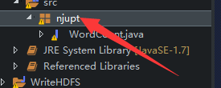
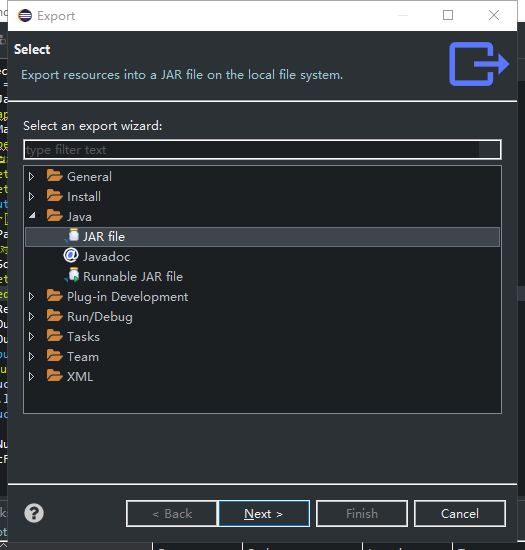
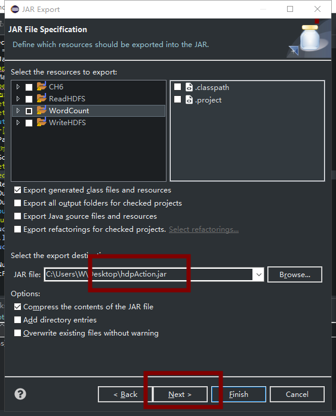
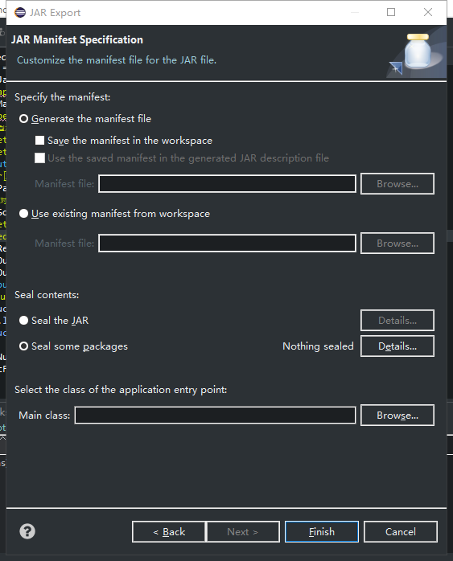
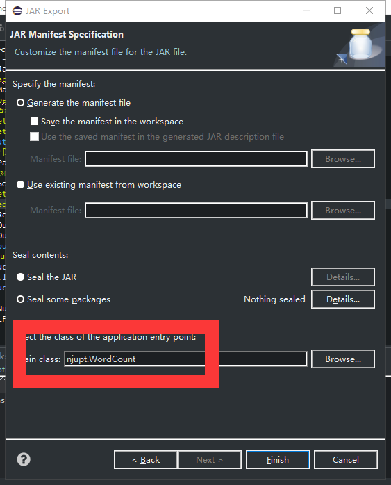

# 实验五 MapReduce实验：单词计数
## 5.1 实验目的
基于MapReduce思想，编写WordCount程序。
## 5.2 实验要求
1．理解MapReduce编程思想；  
2．会编写MapReduce版本WordCount；  
3．会执行该程序；  
4．自行分析执行过程。  
## 5.3 实验原理
MapReduce是一种计算模型，简单的说就是将大批量的工作（数据）分解（MAP）执行，然后再将结果合并成最终结果（REDUCE）。这样做的好处是可以在任务被分解后，可以通过大量机器进行并行计算，减少整个操作的时间。  
适用范围：数据量大，但是数据种类小可以放入内存。  
基本原理及要点：将数据交给不同的机器去处理，数据划分，结果归约。  
理解MapReduce和Yarn：在新版Hadoop中，Yarn作为一个资源管理调度框架，是Hadoop下MapReduce程序运行的生存环境。其实MapRuduce除了可以运行Yarn框架下，也可以运行在诸如Mesos，Corona之类的调度框架上，使用不同的调度框架，需要针对Hadoop做不同的适配。  
一个完成的MapReduce程序在Yarn中执行过程如下：  
（1）ResourcManager JobClient向ResourcManager提交一个job。  
（2）ResourcManager向Scheduler请求一个供MRAppMaster运行的container，然后启动它。  
（3）MRAppMaster启动起来后向ResourcManager注册。  
（4）ResourcManagerJobClient向ResourcManager获取到MRAppMaster相关的信息，然后直接与MRAppMaster进行通信。  
（5）MRAppMaster算splits并为所有的map构造资源请求。  
（6）MRAppMaster做一些必要的MR OutputCommitter的准备工作。  
（7）MRAppMaster向RM(Scheduler)发起资源请求，得到一组供map/reduce task运行的container，然后与NodeManager一起对每一个container执行一些必要的任务，包括资源本地化等。  
（8）MRAppMaster 监视运行着的task 直到完成，当task失败时，申请新的container运行失败的task。  
（9）当每个map/reduce task完成后，MRAppMaster运行MR OutputCommitter的cleanup 代码，也就是进行一些收尾工作。  
（10）当所有的map/reduce完成后，MRAppMaster运行OutputCommitter的必要的job commit或者abort APIs。  
（11）MRAppMaster退出。  
### 5.3.1 MapReduce编程
编写在Hadoop中依赖Yarn框架执行的MapReduce程序，并不需要自己开发MRAppMaster和YARNRunner，因为Hadoop已经默认提供通用的YARNRunner和MRAppMaster程序， 大部分情况下只需要编写相应的Map处理和Reduce处理过程的业务程序即可。   
编写一个MapReduce程序并不复杂，关键点在于掌握分布式的编程思想和方法，主要将计算过程分为以下五个步骤：  
（1）迭代。遍历输入数据，并将之解析成key/value对。  
（2）将输入key/value对映射(map)成另外一些key/value对。  
（3）依据key对中间数据进行分组(grouping)。  
（4）以组为单位对数据进行归约(reduce)。  
（5）迭代。将最终产生的key/value对保存到输出文件中。  
### 5.3.2 Java API解析  
（1）InputFormat：用于描述输入数据的格式，常用的为TextInputFormat提供如下两个功能：  
数据切分： 按照某个策略将输入数据切分成若干个split，以便确定Map Task个数以及对应的split。  
为Mapper提供数据：给定某个split，能将其解析成一个个key/value对。
（2）OutputFormat：用于描述输出数据的格式，它能够将用户提供的key/value对写入特定格式的文件中。  
（3）Mapper/Reducer: Mapper/Reducer中封装了应用程序的数据处理逻辑。  
（4）Writable:Hadoop自定义的序列化接口。实现该类的接口可以用作  MapReduce过程中的value数据使用。  
（5）WritableComparable：在Writable基础上继承了Comparable接口，实现该类的接口可以用作MapReduce过程中的key数据使用。（因为key包含了比较排序的操作）。  
## 5.4 实验步骤

### 5.4.1 编写MapReduce程序
主要编写Map和Reduce类，其中Map过程需要继承org.apache.hadoop.mapreduce包中Mapper类，并重写其map方法；Reduce过程需要继承org.apache.hadoop.mapreduce包中Reduce类，并重写其reduce方法
```java
import org.apache.hadoop.conf.Configuration;
import org.apache.hadoop.fs.Path;
import org.apache.hadoop.io.IntWritable;
import org.apache.hadoop.io.Text;
import org.apache.hadoop.mapreduce.Job;
import org.apache.hadoop.mapreduce.Mapper;
import org.apache.hadoop.mapreduce.Reducer;
import org.apache.hadoop.mapreduce.lib.input.TextInputFormat;
import org.apache.hadoop.mapreduce.lib.output.TextOutputFormat;
import org.apache.hadoop.mapreduce.lib.partition.HashPartitioner;

import java.io.IOException;
import java.util.StringTokenizer;


public class WordCount {
    public static class TokenizerMapper extends Mapper<Object, Text, Text, IntWritable> {
        private final static IntWritable one = new IntWritable(1);
        private Text word = new Text();
        //map方法，划分一行文本，读一个单词写出一个<单词,1>
        public void map(Object key, Text value, Context context)throws IOException, InterruptedException {
            StringTokenizer itr = new StringTokenizer(value.toString());
            while (itr.hasMoreTokens()) {
                word.set(itr.nextToken());
                context.write(word, one);//写出<单词,1>
            }
        }
    }
    //定义reduce类，对相同的单词，把它们中的VList值全部相加
    public static class IntSumReducer extends Reducer<Text, IntWritable, Text, IntWritable> {
        private IntWritable result = new IntWritable();
        public void reduce(Text key, Iterable<IntWritable> values,Context context)
                throws IOException, InterruptedException {
            int sum = 0;
            for (IntWritable val : values) {
                sum += val.get();//相当于<Hello,1><Hello,1>，将两个1相加
            }
            result.set(sum);
            context.write(key, result);//写出这个单词，和这个单词出现次数<单词，单词出现次数>
        }
    }
    public static void main(String[] args) throws Exception {//主方法，函数入口
        Configuration conf = new Configuration();           //实例化配置文件类
        Job job = new Job(conf, "WordCount");             //实例化Job类
        job.setInputFormatClass(TextInputFormat.class);     //指定使用默认输入格式类
        TextInputFormat.setInputPaths(job, args[0]);      //设置待处理文件的位置
        job.setJarByClass(WordCount.class);               //设置主类名
        job.setMapperClass(TokenizerMapper.class);        //指定使用上述自定义Map类
        job.setCombinerClass(IntSumReducer.class);        //指定开启Combiner函数
        job.setMapOutputKeyClass(Text.class);            //指定Map类输出的，K类型
        job.setMapOutputValueClass(IntWritable.class);     //指定Map类输出的，V类型
        job.setPartitionerClass(HashPartitioner.class);       //指定使用默认的HashPartitioner类
        job.setReducerClass(IntSumReducer.class);         //指定使用上述自定义Reduce类
        job.setNumReduceTasks(Integer.parseInt(args[2]));  //指定Reduce个数
        job.setOutputKeyClass(Text.class);                //指定Reduce类输出的,K类型
        job.setOutputValueClass(Text.class);               //指定Reduce类输出的,V类型
        job.setOutputFormatClass(TextOutputFormat.class);  //指定使用默认输出格式类
        TextOutputFormat.setOutputPath(job, new Path(args[1]));    //设置输出结果文件位置
        System.exit(job.waitForCompletion(true) ? 0 : 1);    //提交任务并监控任务状态
    }
}
```
###  5.4.3 使用Eclipse开发工具将该代码打包
假定打包后的文件名为hdpAction.jar，主类WordCount位于包njupt下，则可使用如下命令向YARN集群提交本应用。  




###  `选择了主类和没有选主类命令不一样，要特别注意！！！！！导出jar以后要用sftp从本地传到master服务器`


**[root@master ~]# yarn  jar  hdpAction.jar  njupt.WordCount  /word  /wordcount 1**


**[root@master ~]# yarn  jar  hdpAction.jar  /word  /wordcount1 1**

<br />
其中“yarn”为命令，“jar”为命令参数，后面紧跟打包后的代码地址，“njupt”为包名，“WordCount”为主类名，“/word”为输入文件在HDFS中的位置，/wordcount为输出文件在HDFS中的位置。


### 5.4.2 主要步骤
本实验主要分为，确认前期准备，编写MapReduce程序，打包提交代码。查看运行结果这几个步骤，详细如下：  

```
[stu050 root@master ~]# cd /usr/cstor/hadoop/


[stu050 root@master hadoop]# sbin/start-all.sh
This script is Deprecated. Instead use start-dfs.sh and start-yarn.sh
Starting namenodes on [master]
master: namenode running as process 652. Stop it first.
slave2: datanode running as process 347. Stop it first.
slave1: datanode running as process 347. Stop it first.
slave3: datanode running as process 347. Stop it first.
Starting secondary namenodes [0.0.0.0]
0.0.0.0: secondarynamenode running as process 899. Stop it first.
starting yarn daemons
starting resourcemanager, logging to /usr/cstor/hadoop/logs/yarn-root-resourcemanager-master.out
slave2: nodemanager running as process 476. Stop it first.
slave1: nodemanager running as process 476. Stop it first.
slave3: nodemanager running as process 476. Stop it first.


[stu050 root@master hadoop]# jps
652 NameNode
1143 ResourceManager
899 SecondaryNameNode
2047 Jps


[stu050 root@master hadoop]# ssh slave1
Last login: Sun Nov 24 20:58:48 2019 from 10.30.84.18


[stu050 root@slave1 ~]# jps
476 NodeManager
785 Jps
347 DataNode


[stu050 root@slave1 ~]# exit
logout
Connection to slave1 closed.


[stu050 root@master hadoop]# ssh slave2
Last login: Sun Nov 24 20:52:42 2019 from 10.30.84.18


[stu050 root@slave2 ~]# jps
476 NodeManager
785 Jps
347 DataNode


[stu050 root@slave2 ~]# exit
logout
Connection to slave2 closed.


[stu050 root@master hadoop]# bin/hadoop fs -ls /     


[stu050 root@master hadoop]# cat /root/data/5/word
aaa
bbb bbb bbb 
ccc ccc ccc ccc ccc
bbb bbb 
qq
qq qq qq qq 
aaa aaa 
aa aaa


[stu050 root@master hadoop]# hadoop fs -put /root/data/5/word  /


[stu050 root@master hadoop]# bin/hadoop fs -ls /     
Found 1 items
-rw-r--r--   3 root supergroup         78 2019-11-24 20:54 /word


[stu050 root@master hadoop]# cd ..


[stu050 root@master cstor]# cd ..


[stu050 root@master usr]# cd ..


[stu050 root@master /]# cd root


[stu050 root@master ~]# ls
anaconda-ks.cfg  data  hdpAction.jar  notebooks


[stu050 root@master ~]# yarn  jar  hdpAction.jar  njupt.WordCount  /word  /wordcount 1
19/11/24 20:58:08 INFO client.RMProxy: Connecting to ResourceManager at master/10.30.100.18:8032
19/11/24 20:58:08 WARN mapreduce.JobResourceUploader: Hadoop command-line option parsing not performed. Implement the Tool interface and execute your application with ToolRunner to remedy this.
19/11/24 20:58:09 INFO input.FileInputFormat: Total input paths to process : 1
19/11/24 20:58:09 INFO mapreduce.JobSubmitter: number of splits:1
19/11/24 20:58:09 INFO mapreduce.JobSubmitter: Submitting tokens for job: job_1574599886270_0001
19/11/24 20:58:10 INFO impl.YarnClientImpl: Submitted application application_1574599886270_0001
19/11/24 20:58:10 INFO mapreduce.Job: The url to track the job: http://master:8088/proxy/application_1574599886270_0001/
19/11/24 20:58:10 INFO mapreduce.Job: Running job: job_1574599886270_0001
19/11/24 20:58:17 INFO mapreduce.Job: Job job_1574599886270_0001 running in uber mode : false
19/11/24 20:58:17 INFO mapreduce.Job:  map 0% reduce 0%
19/11/24 20:58:22 INFO mapreduce.Job:  map 100% reduce 0%
19/11/24 20:58:28 INFO mapreduce.Job:  map 100% reduce 100%
19/11/24 20:58:28 INFO mapreduce.Job: Job job_1574599886270_0001 completed successfully
19/11/24 20:58:28 INFO mapreduce.Job: Counters: 49
	File System Counters
		FILE: Number of bytes read=54
		FILE: Number of bytes written=232213
		FILE: Number of read operations=0
		FILE: Number of large read operations=0
		FILE: Number of write operations=0
		HDFS: Number of bytes read=166
		HDFS: Number of bytes written=28
		HDFS: Number of read operations=6
		HDFS: Number of large read operations=0
		HDFS: Number of write operations=2
	Job Counters 
		Launched map tasks=1
		Launched reduce tasks=1
		Data-local map tasks=1
		Total time spent by all maps in occupied slots (ms)=3169
		Total time spent by all reduces in occupied slots (ms)=3526
		Total time spent by all map tasks (ms)=3169
		Total time spent by all reduce tasks (ms)=3526
		Total vcore-seconds taken by all map tasks=3169
		Total vcore-seconds taken by all reduce tasks=3526
		Total megabyte-seconds taken by all map tasks=3245056
		Total megabyte-seconds taken by all reduce tasks=3610624
	Map-Reduce Framework
		Map input records=8
		Map output records=20
		Map output bytes=154
		Map output materialized bytes=54
		Input split bytes=88
		Combine input records=20
		Combine output records=5
		Reduce input groups=5
		Reduce shuffle bytes=54
		Reduce input records=5
		Reduce output records=5
		Spilled Records=10
		Shuffled Maps =1
		Failed Shuffles=0
		Merged Map outputs=1
		GC time elapsed (ms)=280
		CPU time spent (ms)=3880
		Physical memory (bytes) snapshot=429633536
		Virtual memory (bytes) snapshot=1745117184
		Total committed heap usage (bytes)=402653184
	Shuffle Errors
		BAD_ID=0
		CONNECTION=0
		IO_ERROR=0
		WRONG_LENGTH=0
		WRONG_MAP=0
		WRONG_REDUCE=0
	File Input Format Counters 
		Bytes Read=78
	File Output Format Counters 
		Bytes Written=28
[stu050 root@master ~]# hadoop fs -cat /wordcount/part-r-00000
aa	1
aaa	4
bbb	5
ccc	5
qq	5


[stu050 root@master ~]# yarn  jar  hdpAction.jar  /word  /wordcount1 1
19/11/24 21:05:21 INFO client.RMProxy: Connecting to ResourceManager at master/10.30.100.18:8032
19/11/24 21:05:21 WARN mapreduce.JobResourceUploader: Hadoop command-line option parsing not performed. Implement the Tool interface and execute your application with ToolRunner to remedy this.
19/11/24 21:05:22 INFO input.FileInputFormat: Total input paths to process : 1
19/11/24 21:05:22 INFO mapreduce.JobSubmitter: number of splits:1
19/11/24 21:05:22 INFO mapreduce.JobSubmitter: Submitting tokens for job: job_1574599886270_0002
19/11/24 21:05:22 INFO impl.YarnClientImpl: Submitted application application_1574599886270_0002
19/11/24 21:05:22 INFO mapreduce.Job: The url to track the job: http://master:8088/proxy/application_1574599886270_0002/
19/11/24 21:05:22 INFO mapreduce.Job: Running job: job_1574599886270_0002
19/11/24 21:05:29 INFO mapreduce.Job: Job job_1574599886270_0002 running in uber mode : false
19/11/24 21:05:29 INFO mapreduce.Job:  map 0% reduce 0%
19/11/24 21:05:34 INFO mapreduce.Job:  map 100% reduce 0%
19/11/24 21:05:40 INFO mapreduce.Job:  map 100% reduce 100%
19/11/24 21:05:40 INFO mapreduce.Job: Job job_1574599886270_0002 completed successfully
19/11/24 21:05:41 INFO mapreduce.Job: Counters: 49
	File System Counters
		FILE: Number of bytes read=54
		FILE: Number of bytes written=232215
		FILE: Number of read operations=0
		FILE: Number of large read operations=0
		FILE: Number of write operations=0
		HDFS: Number of bytes read=166
		HDFS: Number of bytes written=28
		HDFS: Number of read operations=6
		HDFS: Number of large read operations=0
		HDFS: Number of write operations=2
	Job Counters 
		Launched map tasks=1
		Launched reduce tasks=1
		Data-local map tasks=1
		Total time spent by all maps in occupied slots (ms)=3196
		Total time spent by all reduces in occupied slots (ms)=3312
		Total time spent by all map tasks (ms)=3196
		Total time spent by all reduce tasks (ms)=3312
		Total vcore-seconds taken by all map tasks=3196
		Total vcore-seconds taken by all reduce tasks=3312
		Total megabyte-seconds taken by all map tasks=3272704
		Total megabyte-seconds taken by all reduce tasks=3391488
	Map-Reduce Framework
		Map input records=8
		Map output records=20
		Map output bytes=154
		Map output materialized bytes=54
		Input split bytes=88
		Combine input records=20
		Combine output records=5
		Reduce input groups=5
		Reduce shuffle bytes=54
		Reduce input records=5
		Reduce output records=5
		Spilled Records=10
		Shuffled Maps =1
		Failed Shuffles=0
		Merged Map outputs=1
		GC time elapsed (ms)=201
		CPU time spent (ms)=2060
		Physical memory (bytes) snapshot=428113920
		Virtual memory (bytes) snapshot=1725104128
		Total committed heap usage (bytes)=402653184
	Shuffle Errors
		BAD_ID=0
		CONNECTION=0
		IO_ERROR=0
		WRONG_LENGTH=0
		WRONG_MAP=0
		WRONG_REDUCE=0
	File Input Format Counters 
		Bytes Read=78
	File Output Format Counters 
		Bytes Written=28


[stu050 root@master ~]# hadoop fs -ls /
Found 4 items
drwx------   - root supergroup          0 2019-11-24 20:58 /tmp
-rw-r--r--   3 root supergroup         78 2019-11-24 20:54 /word
drwxr-xr-x   - root supergroup          0 2019-11-24 20:58 /wordcount
drwxr-xr-x   - root supergroup          0 2019-11-24 21:05 /wordcount1


[stu050 root@master ~]# hadoop fs -cat /wordcount/part-r-00000
aa	1
aaa	4
bbb	5
ccc	5
qq	5


[stu050 root@master ~]# hadoop fs -cat /wordcount1/part-r-00000
aa	1
aaa	4
bbb	5
ccc	5
qq	5
```
