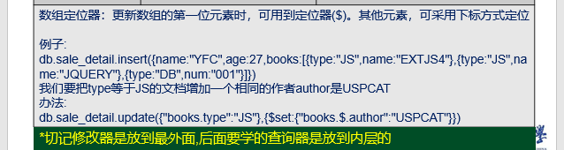

# [\<identifier\>\]
## [MongoDb Documentation](https://docs.mongodb.com/manual/reference/operator/update/positional-filtered/#position-nested-arrays-filtered)

## Definition

The filtered positional operator $[<identifier>] identifies the array elements that match the arrayFilters conditions for an update operation, e.g. db.collection.update() 

Use in conjunction with the arrayFilters option to update all elements that match the arrayFilters conditions in the document or documents that match the query conditions. For example:
```
db.collection.updateMany(
   { <query conditions> },
   { <update operator>: { "<array>.$[<identifier>]" : value } },
   { arrayFilters: [ { <identifier>: <condition> } ] }
)
```

`Note:`The <identifier> must begin with a lowercase letter and contain only alphanumeric characters.  

## Behavior

### upsert

If an upsert operation results in an insert, the query must include an exact equality match on the array field in order to use $[<identifier>] in the update statement.  

## Examples

### Update All Array Elements That Match arrayFilters

The positional $[<identifier>] operator acts as a placeholder for all elements in the array field that match the conditions specified in arrayFilters.  


```
> db.students.insert([
... { "_id" : 1, "grades" : [ 95, 92, 90 ] },
... { "_id" : 2, "grades" : [ 98, 100, 102 ] },
... { "_id" : 3, "grades" : [ 95, 110, 100 ] },
... ])
BulkWriteResult({
        "writeErrors" : [ ],
        "writeConcernErrors" : [ ],
        "nInserted" : 3,
        "nUpserted" : 0,
        "nMatched" : 0,
        "nModified" : 0,
        "nRemoved" : 0,
        "upserted" : [ ]
})
> db.students.update(
...    { },
...    { $set: { "grades.$[element]" : 100 } },
...    { multi: true,
...      arrayFilters: [ { "element": { $gte: 100 } } ]
...    }
... )
WriteResult({ "nMatched" : 3, "nUpserted" : 0, "nModified" : 2 })
> db.students.find().pretty()
{ "_id" : 1, "grades" : [ 95, 92, 90 ] }
{ "_id" : 2, "grades" : [ 98, 100, 100 ] }
{ "_id" : 3, "grades" : [ 95, 100, 100 ] }
```

### Update All Documents That Match arrayFilters in an Array

The $[<identifier>] operator facilitates updates to arrays that contain embedded documents. To access the fields in the embedded documents, use the dot notation on the $[<identifier>].  

```
db.collection.update(
   { <query selector> },
   { <update operator>: { "array.$[<identifier>].field" : value } },
   { arrayFilters: [ { <identifier>: <condition> } } ] }
)
```

`WriteResult({ "nMatched" : 3, "nUpserted" : 0, "nModified" : 2 })`  because `{ <query conditions> }` is empty

```
db.students2.insert([
{
   "_id" : 1,
   "grades" : [
      { "grade" : 80, "mean" : 75, "std" : 6 },
      { "grade" : 85, "mean" : 90, "std" : 4 },
      { "grade" : 85, "mean" : 85, "std" : 6 }
   ]
},
{
   "_id" : 2,
   "grades" : [
      { "grade" : 90, "mean" : 75, "std" : 6 },
      { "grade" : 87, "mean" : 90, "std" : 3 },
      { "grade" : 85, "mean" : 85, "std" : 4 }
   ]
},
{
   "_id" : 3,
   "grades" : [
      { "grade" : 84, "mean" : 80, "std" : 6 },
      { "grade" : 78, "mean" : 76, "std" : 3 },
      { "grade" : 67, "mean" : 60, "std" : 4 }
   ]
}])

> db.students2.update(
...    { },
...    { $set: { "grades.$[elem].mean" : 100 } },
...    {
...      multi: true,
...      arrayFilters: [ { "elem.grade": { $gte: 85 } } ]
...    }
... )
WriteResult({ "nMatched" : 3, "nUpserted" : 0, "nModified" : 2 })
> db.students2.find().pretty()
{
        "_id" : 1,
        "grades" : [
                {
                        "grade" : 80,
                        "mean" : 75,
                        "std" : 6
                },
                {
                        "grade" : 85,
                        "mean" : 100,
                        "std" : 4
                },
                {
                        "grade" : 85,
                        "mean" : 100,
                        "std" : 6
                }
        ]
}
{
        "_id" : 2,
        "grades" : [
                {
                        "grade" : 90,
                        "mean" : 100,
                        "std" : 6
                },
                {
                        "grade" : 87,
                        "mean" : 100,
                        "std" : 3
                },
                {
                        "grade" : 85,
                        "mean" : 100,
                        "std" : 4
                }
        ]
}
{
        "_id" : 3,
        "grades" : [
                {
                        "grade" : 84,
                        "mean" : 80,
                        "std" : 6
                },
                {
                        "grade" : 78,
                        "mean" : 76,
                        "std" : 3
                },
                {
                        "grade" : 67,
                        "mean" : 60,
                        "std" : 4
                }
        ]
}
```
## Example 1



```  
> db.sale_detail.find().pretty()
{
        "_id" : ObjectId("5ddb99661e045692bffb44ae"),
        "name" : "YFC",
        "age" : 27,
        "books" : [
                {
                        "type" : "JS",
                        "name" : "EXTJS4"
                },
                {
                        "type" : "JS",
                        "name" : "JQUERY"
                },
                {
                        "type" : "DB",
                        "num" : "001"
                }
        ]
}
> db.sale_detail.update(
... {},
... {$set:{"books.$[elem].author":"Mr.Z"}},
... {multi:true,arrayFilters:[{"elem.type":"JS"}]}
... )
WriteResult({ "nMatched" : 1, "nUpserted" : 0, "nModified" : 1 })
> db.sale_detail.find().pretty()
{
        "_id" : ObjectId("5ddb99661e045692bffb44ae"),
        "name" : "YFC",
        "age" : 27,
        "books" : [
                {
                        "type" : "JS",
                        "name" : "EXTJS4",
                        "author" : "Mr.Z"
                },
                {
                        "type" : "JS",
                        "name" : "JQUERY",
                        "author" : "Mr.Z"
                },
                {
                        "type" : "DB",
                        "num" : "001"
                }
        ]
}
```

### Update All Array Elements that Match Multiple Conditions

```
> db.students3.insert([
... {
...    "_id" : 1,
...    "grades" : [
...       { "grade" : 80, "mean" : 75, "std" : 6 },
...       { "grade" : 85, "mean" : 100, "std" : 4 },
...       { "grade" : 85, "mean" : 100, "std" : 6 }
...    ]
... },
... {
...    "_id" : 2,
...    "grades" : [
...       { "grade" : 90, "mean" : 100, "std" : 6 },
...       { "grade" : 87, "mean" : 100, "std" : 3 },
...       { "grade" : 85, "mean" : 100, "std" : 4 }
...    ]
... }])
BulkWriteResult({
        "writeErrors" : [ ],
        "writeConcernErrors" : [ ],
        "nInserted" : 2,
        "nUpserted" : 0,
        "nMatched" : 0,
        "nModified" : 0,
        "nRemoved" : 0,
        "upserted" : [ ]
})

> db.students3.update(
...    { },
...    { $inc: { "grades.$[elem].std" : -1 } },
...    { arrayFilters: [ { "elem.grade": { $gte: 80 }, "elem.std": { $gt: 5 } } ], multi: true }
... )
WriteResult({ "nMatched" : 2, "nUpserted" : 0, "nModified" : 2 })
> db.students3.find().pretty()
{
        "_id" : 1,
        "grades" : [
                {
                        "grade" : 80,
                        "mean" : 75,
                        "std" : 5
                },
                {
                        "grade" : 85,
                        "mean" : 100,
                        "std" : 4
                },
                {
                        "grade" : 85,
                        "mean" : 100,
                        "std" : 5
                }
        ]
}
{
        "_id" : 2,
        "grades" : [
                {
                        "grade" : 90,
                        "mean" : 100,
                        "std" : 5
                },
                {
                        "grade" : 87,
                        "mean" : 100,
                        "std" : 3
                },
                {
                        "grade" : 85,
                        "mean" : 100,
                        "std" : 4
                }
        ]
}
>
```


### Update Array Elements Using a Negation Operator

To modify all elements in the degrees array that do not have "level": "Bachelor", use the positional [<identifier>] operation with the **`$ne`** query operator:  


```
> db.alumni.insert([
... {
...    "_id": 1,
...    "name": "Christine Franklin",
...    "degrees": [
...       { "level": "Master",
...         "major": "Biology",
...         "completion_year": 2010,
...         "faculty": "Science"
...       },
...       {
...         "level": "Bachelor",
...         "major": "Biology",
...         "completion_year": 2008,
...         "faculty": "Science"
...       }
...    ],
...    "school_email": "cfranklin@example.edu",
...    "email": "christine@example.com"
... },
... {
...    "_id": 2,
...    "name": "Reyansh Sengupta",
...    "degrees": [
...       { "level": "Bachelor",
...         "major": "Chemical Engineering",
...         "completion_year": 2002,
...         "faculty": "Engineering"
...       }
...    ],
...    "school_email": "rsengupta2@example.edu"
... }])
BulkWriteResult({
        "writeErrors" : [ ],
        "writeConcernErrors" : [ ],
        "nInserted" : 2,
        "nUpserted" : 0,
        "nMatched" : 0,
        "nModified" : 0,
        "nRemoved" : 0,
        "upserted" : [ ]
})
> db.alumni.update(
...    { },
...    { $set : { "degrees.$[degree].gradcampaign" : 1 } },
...    { arrayFilters : [ {"degree.level" : { $ne: "Bachelor" } } ],
...      multi : true }
... )
WriteResult({ "nMatched" : 2, "nUpserted" : 0, "nModified" : 1 })
> db.alumni.find().pretty()
{
        "_id" : 1,
        "name" : "Christine Franklin",
        "degrees" : [
                {
                        "level" : "Master",
                        "major" : "Biology",
                        "completion_year" : 2010,
                        "faculty" : "Science",
                        "gradcampaign" : 1
                },
                {
                        "level" : "Bachelor",
                        "major" : "Biology",
                        "completion_year" : 2008,
                        "faculty" : "Science"
                }
        ],
        "school_email" : "cfranklin@example.edu",
        "email" : "christine@example.com"
}
{
        "_id" : 2,
        "name" : "Reyansh Sengupta",
        "degrees" : [
                {
                        "level" : "Bachelor",
                        "major" : "Chemical Engineering",
                        "completion_year" : 2002,
                        "faculty" : "Engineering"
                }
        ],
        "school_email" : "rsengupta2@example.edu"
}
```


### Update Nested Arrays in Conjunction with $[]

The $[<identifier>] filtered positional operator, in conjunction with the $[] all positional operator, can be used to update nested arrays.  


```
> db.students3.insert(
...    { "_id" : 1,
...       "grades" : [
...         { type: "quiz", questions: [ 10, 8, 5 ] },
...         { type: "quiz", questions: [ 8, 9, 6 ] },
...         { type: "hw", questions: [ 5, 4, 3 ] },
...         { type: "exam", questions: [ 25, 10, 23, 0 ] },
...
...       ]
...    }
... )
WriteResult({ "nInserted" : 1 })
> db.students3.update(
...    {},
...    { $inc: { "grades.$[t].questions.$[score]": 2 } },
...    { arrayFilters: [ { "t.type": "quiz" } , { "score": { $gte: 8 } } ], multi: true}
... )
WriteResult({ "nMatched" : 1, "nUpserted" : 0, "nModified" : 1 })
> db.students3.find()
{ "_id" : 1, "grades" : [ { "type" : "quiz", "questions" : [ 12, 10, 5 ] }, { "type" : "quiz", "questions" : [ 10, 11, 6 ] }, { "type" : "hw", "questions" : [ 5, 4, 3 ] }, { "type" : "exam", "questions" : [ 25, 10, 23, 0 ] } ] }
```


