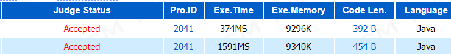

# 2041 超级楼梯
题目链接🔗：http://acm.hdu.edu.cn/showproblem.php?pid=2041

第一行为方式一的运行结果  
第二行为方式二的运行结果  



### 方式一
```java
import java.util.Scanner;

public class Main {

    public static void main(String[] args) {

        int n,x;
        int[] arr = new int[41];
        arr[1] = 1;
        arr[2] = 1;
        for(int i=3;i<=40;i++) {
            arr[i] = arr[i-1]+arr[i-2];
        }
        Scanner input = new Scanner(System.in);
        n = input.nextInt();
        while(n!=0) {
            n--;
            x = input.nextInt();
            System.out.println(arr[x]);
        }
    }
}
```

### 方式二

```java
import java.util.Scanner;

public class Main {
    
    public static void main(String[] args) {
        
        int n,x;
        Scanner input = new Scanner(System.in);
        n = input.nextInt();
        while(n!=0) {
            n--;
            x = input.nextInt();
            System.out.println(function(x));
        }
        
    }
    
    public static int function(int n) {
        if(n == 1) {
            return 1;
        }
        else if(n==2) {
            return 1;
        }
        else {
            return function(n-1)+function(n-2);
        }
    }
}
```

