# IDEA安装scala插件 以及 创建scala项目

### 1. 找到与IDEA对应的scala版本

IDEA的版本可以在`一开始的界面`或者`IDEA的安装目录下文件夹的名称`获得。在网站 https://plugins.jetbrains.com/plugin/1347-scala/versions 可以下载到相应的版本。
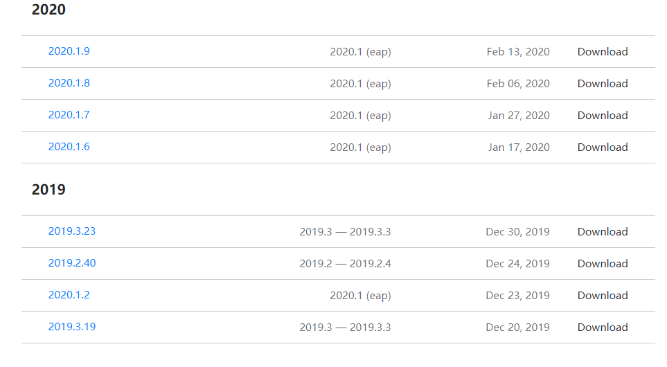  
### 2. 安装插件
我的IDEA版本是2019.1.1，所以再setting中找到Plugins，点击小齿轮的按钮
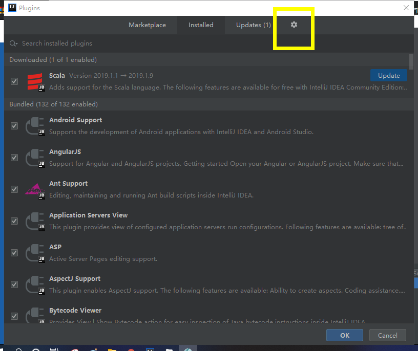  
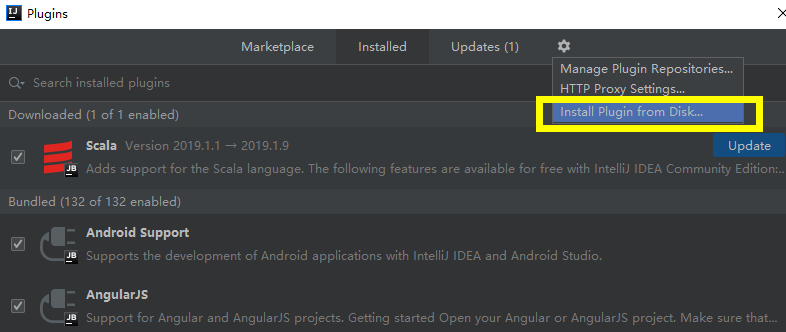  
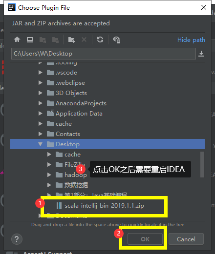  

### 3. IDEA配置Scala SDK
前提是先安装好scala软件，测试是否安装好scala软件，打开cmd，输入`scala -version`，出现下图所示，即安装成功。scala下载网址：https://www.scala-lang.org/download/  
  

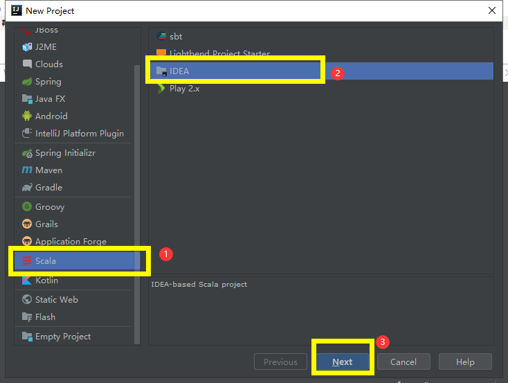  
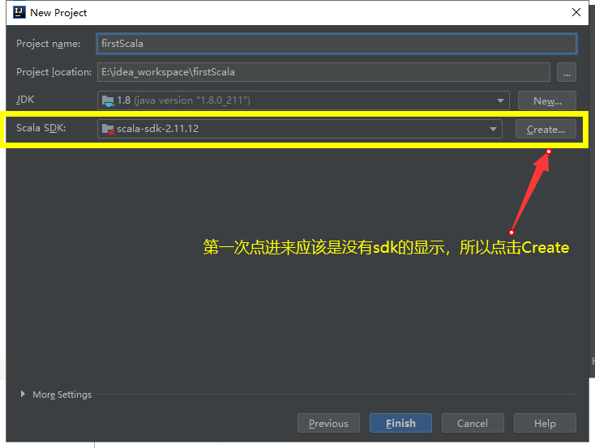  
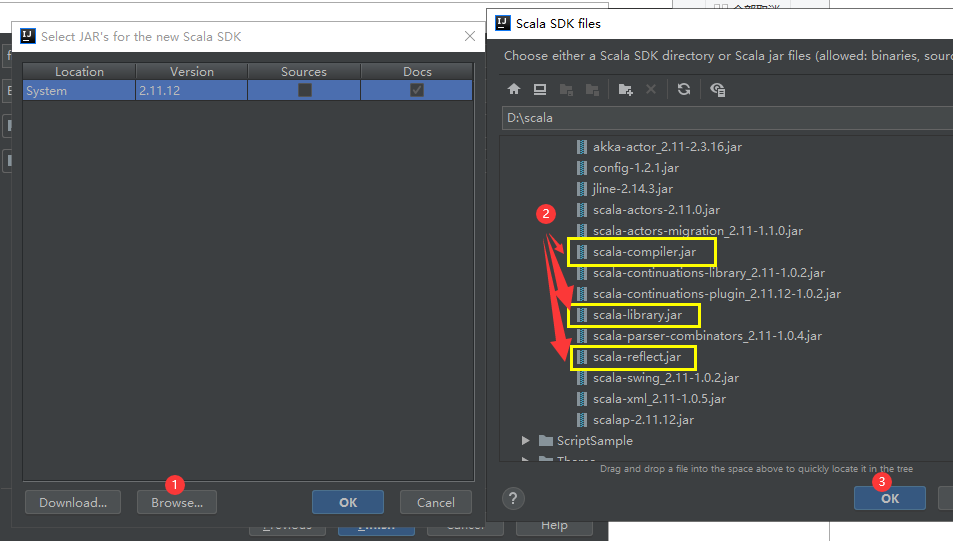
在点击OK之后就可以看到相应的sdk的版本号，点击finish。  

### 4. 创建第一个Scala项目
右键src，创建scala class时填写Name后，在Kind上选择object
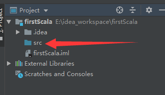  

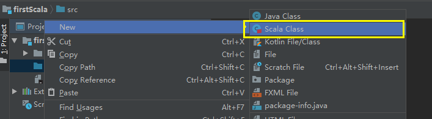  

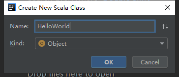  

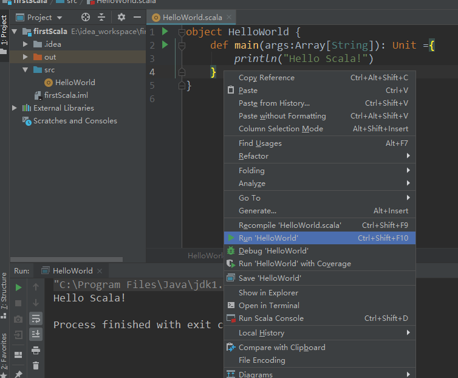  

### 5.参考
IntelliJ IDEA安装scala插件并创建scala的详细教程：https://blog.csdn.net/u013973379/article/details/82826034  

IntelliJ IDEA安装scala插件并创建scala的详细教程：https://blog.csdn.net/Appleyk/article/details/82180599

