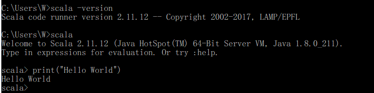

# win下安装scala 
官网：http://www.scala-lang.org/  
1. 自主选择相应的版本号，进行下载msi
2. 将scala安装在指定的目录下
3. 配置环境变量，新建变量SCALA_HOME，再设置Path变量
4. 打开cmd，检查scala是否安装成功
### 过程一
  
### 过程二
  
### 过程三
  
### 过程四
  
### 过程五
  

参考博客：
1. Intellij IDEA 安装Scala插件 + 创建Scala项目（Hello World！）https://blog.csdn.net/Appleyk/article/details/82180599
2. win10安装scala详细步骤  https://www.cnblogs.com/ahu-lichang/p/7197961.html
3. Windows下安装Scala https://blog.csdn.net/qq_40310148/article/details/90345721